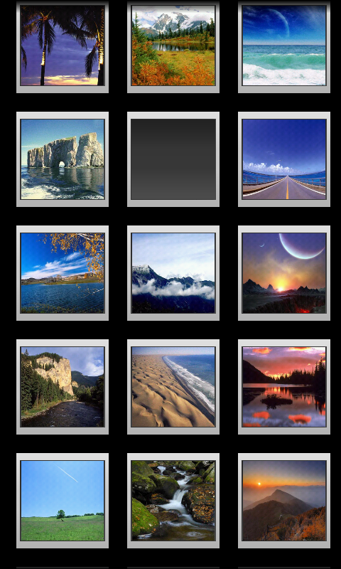
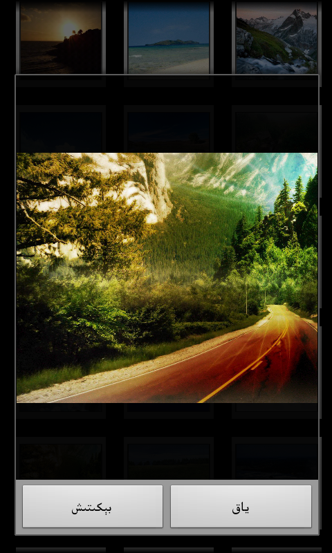

Wallpaper
=========

A simple wallpaper manager for Android. The server side program is based on Microsoft .NET. This app pulls the image address from the XML files saved on the server and set the image as your home screen wallpaper.

‏ئاندرويىد ئۈچۈن تۈزۈلگەن ئاددىي تام قەغەز باشقۇرغۇچ. مۇلازىمتېر تەرەپ پروگراممىسى Microsoft .NET دا تۈزۈلگەن. مەزكۇر ئەپ رەسىم ئادرېسىنى مۇلازىمىتېردىكى XML ھۆججىتىدىن ئوقۇپ ئالىدۇ ۋە رەسىمنى تام قەغەز قىلىپ بېكىتىپ بېرىدۇ.

How To Use
---------
Change the server address to your url of choice in values/strings.xml

Download Link:
----------
[Download from Bilkan Bazar](http://bazar.bilkan.net/App.aspx?id=178)
